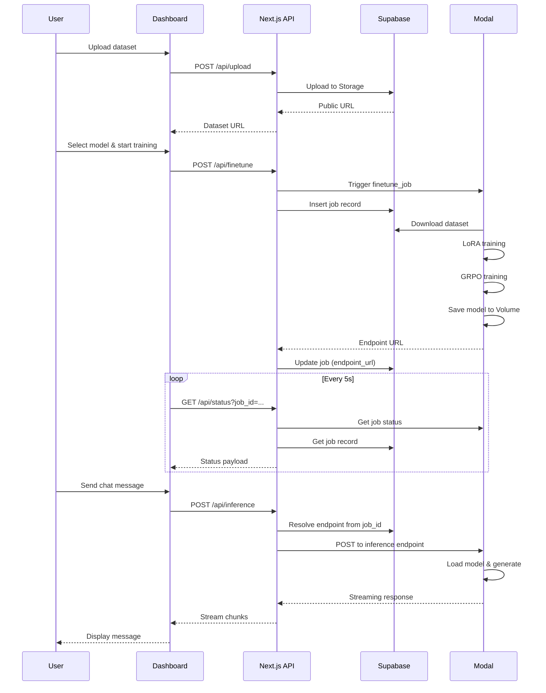

# FinSureAI - Comprehensive Project Analysis

## Executive Summary

**FinSureAI** is a full-stack B2B SaaS platform that enables users to fine-tune large language models (LLMs) on proprietary financial datasets. The platform provides an end-to-end workflow: dataset upload, GPU-accelerated fine-tuning via Modal, job monitoring, and interactive chat with the fine-tuned models.

**Core Value Proposition**: Upload financial datasets, trigger GPU fine-tuning jobs (LoRA + GRPO), monitor progress in real-time, and chat with the resulting fine-tuned models—all through a modern web interface.

---

## Step 1: Project Overview

### High-Level Purpose

FinSureAI bridges the gap between financial data and AI model customization. It allows organizations to:
1. **Upload** proprietary financial datasets (JSON/JSONL/ZIP formats)
2. **Fine-tune** pre-trained models (Qwen or Llama) using LoRA (Low-Rank Adaptation) and GRPO (Group Relative Policy Optimization)
3. **Monitor** training jobs in real-time with progress tracking and logs
4. **Interact** with fine-tuned models through a chat interface

### Tech Stack

#### Frontend
- **Framework**: Next.js 14 (App Router) with React 18.3.1
- **Language**: TypeScript 5.5.4
- **Styling**: Tailwind CSS 3.4.10 with custom dark theme (slate-950 background)
- **UI Components**: shadcn/ui (Radix UI primitives)
- **Icons**: Lucide React
- **Package Manager**: pnpm (evidenced by `pnpm-lock.yaml`)

#### Backend/API
- **Runtime**: Next.js API Routes (serverless functions on Vercel)
- **Authentication**: Supabase Auth (email/password) with SSR support
- **Storage**: Supabase Storage (for dataset files)
- **Database**: Supabase PostgreSQL (for job metadata)

#### ML/AI Infrastructure
- **GPU Compute**: Modal (serverless GPU platform)
- **ML Framework**: PyTorch 2.0+, Transformers, PEFT, TRL
- **Fine-tuning Methods**: 
  - LoRA (Low-Rank Adaptation) for parameter-efficient fine-tuning
  - GRPO (Group Relative Policy Optimization) for reinforcement learning
- **Models Supported**:
  - `Qwen/Qwen3-4B-Instruct-2507` (4B parameters, cost-optimized)
  - `meta-llama/Llama-3.1-70B-Instruct` (70B parameters, accuracy-optimized)

#### Development Tools
- **Testing**: Vitest 1.6.0
- **Linting**: ESLint with Next.js config
- **Build Tool**: Next.js built-in (Webpack/Turbopack)
- **Deployment**: Vercel (configured via `vercel.json`)

#### Python Dependencies (Modal/Backend)
- PyTorch, Transformers, Datasets, PEFT, TRL, Accelerate
- Modal SDK for serverless GPU execution
- Sentence Transformers (for reward computation)
- DSPy (for agent inference)

### Project Structure

```
FinSureAI/
├── app/                          # Next.js App Router
│   ├── api/                      # Serverless API routes
│   │   ├── finetune/route.ts     # Trigger Modal fine-tuning jobs
│   │   ├── inference/route.ts    # Proxy inference requests to Modal
│   │   ├── status/route.ts       # Poll job status from Modal
│   │   └── upload/route.ts       # Upload datasets to Supabase Storage
│   ├── components/               # React components
│   │   ├── ui/                   # shadcn/ui primitives (button, card, input, progress)
│   │   ├── AuthForm.tsx          # Sign in/up form
│   │   ├── ChatBox.tsx           # Interactive chat with fine-tuned model
│   │   ├── DashboardClient.tsx   # Main dashboard (client component)
│   │   ├── FileUpload.tsx        # Drag-and-drop dataset uploader
│   │   ├── ModelSelect.tsx       # Base model selector
│   │   ├── Navbar.tsx            # Navigation with auth state
│   │   ├── ProgressBar.tsx       # Job progress visualization
│   │   ├── SignOutButton.tsx     # Sign out handler
│   │   └── TrainButton.tsx       # Trigger fine-tuning job
│   ├── dashboard/
│   │   ├── DashboardClient.tsx   # Client-side dashboard logic
│   │   └── page.tsx              # Dashboard server component
│   ├── styles/
│   │   └── globals.css           # Global Tailwind styles
│   ├── layout.tsx                # Root layout with Navbar
│   └── page.tsx                  # Landing page (auth redirect)
├── backend/                      # Python utilities (local dev/research)
│   ├── benchmark.py              # Model benchmarking scripts
│   ├── config.yaml               # Training configuration
│   ├── inference/
│   │   └── agents_inference.py  # Inference utilities
│   ├── legacy/                   # Legacy code (reference only)
│   └── test_dataset.py           # Dataset testing utilities
├── lib/                          # Shared TypeScript utilities
│   ├── env.ts                    # Environment variable helpers
│   ├── modalClient.ts            # Modal API client (currently mocked)
│   ├── supabaseAdmin.ts          # Supabase service role client
│   ├── supabaseClient.ts         # Supabase browser client
│   ├── supabaseServer.ts         # Supabase server-side client
│   ├── types.ts                  # TypeScript type definitions
│   └── utils.ts                  # Utility functions (cn, formatBytes)
├── modal/                        # Modal deployment scripts
│   ├── Dockerfile                # Container definition for Modal
│   ├── finetune_job.py           # GPU fine-tuning job (LoRA + GRPO)
│   ├── inference_job.py          # Model inference web endpoint
│   ├── reward.py                 # GRPO reward function
│   └── requirements.txt          # Python dependencies for Modal
├── tests/                        # Vitest test suites
│   └── api/                      # API route tests
│       ├── finetune.test.ts      # Fine-tuning trigger tests
│       ├── inference.test.ts     # Inference proxy tests
│       └── upload.test.ts        # Dataset upload tests
├── middleware.ts                 # Next.js middleware (auth protection)
├── next.config.mjs              # Next.js configuration
├── package.json                 # Node.js dependencies
├── requirements.txt             # Python dependencies (local)
├── tailwind.config.ts          # Tailwind CSS configuration
├── tsconfig.json               # TypeScript configuration
├── vercel.json                 # Vercel deployment config
└── vitest.config.ts            # Vitest test configuration
```

### Entry Points

1. **Frontend Entry**: `app/layout.tsx` → `app/page.tsx` (landing) or `app/dashboard/page.tsx` (authenticated)
2. **API Routes**: 
   - `/api/upload` (POST) - Dataset upload
   - `/api/finetune` (POST) - Trigger fine-tuning
   - `/api/status` (GET) - Job status polling
   - `/api/inference` (POST) - Model inference
3. **Modal Jobs**: 
   - `modal/finetune_job.py` - Fine-tuning function
   - `modal/inference_job.py` - Inference endpoint

---

## Step 2: File-by-File Breakdown

### Frontend Application (`app/`)

#### `app/layout.tsx`
- **Purpose**: Root layout component wrapping all pages
- **Key Features**:
  - Imports global CSS
  - Sets metadata (title, description)
  - Renders Navbar and main content area
  - Dark theme styling (slate-950 background)

#### `app/page.tsx`
- **Purpose**: Landing page with authentication check
- **Key Features**:
  - Server component that checks Supabase session
  - Redirects authenticated users to `/dashboard`
  - Renders `AuthForm` for unauthenticated users
  - Marketing copy about fine-tuning financial models

#### `app/dashboard/page.tsx`
- **Purpose**: Protected dashboard page (server component)
- **Key Features**:
  - Verifies authentication via Supabase
  - Redirects to `/` if not authenticated
  - Passes `userId` to `DashboardClient` component

#### `app/dashboard/DashboardClient.tsx`
- **Purpose**: Main dashboard UI (client component)
- **Key Features**:
  - Manages state: dataset, model selection, job ID, status, errors
  - Polls `/api/status` every 5 seconds when job is active
  - Orchestrates: file upload → model selection → training trigger → progress monitoring → chat
  - Grid layout with two columns: controls (left) and chat (right)
  - Displays job details, logs, and progress

#### `app/components/AuthForm.tsx`
- **Purpose**: Sign in/sign up form
- **Key Features**:
  - Toggles between sign-in and sign-up modes
  - Uses Supabase Auth (`signUp` or `signInWithPassword`)
  - Error handling and loading states
  - Client component with form validation

#### `app/components/FileUpload.tsx`
- **Purpose**: Drag-and-drop file uploader for datasets
- **Key Features**:
  - Accepts `.json`, `.jsonl`, `.zip` files
  - Drag-and-drop and click-to-upload
  - Uploads to `/api/upload` endpoint
  - Progress indication and error handling
  - Calls `onUploadComplete` callback with file metadata

#### `app/components/ModelSelect.tsx`
- **Purpose**: Base model selector
- **Key Features**:
  - Radio button interface for model selection
  - Two models: Qwen (4B) and Llama (70B)
  - Visual feedback for selected model
  - Client component with controlled state

#### `app/components/TrainButton.tsx`
- **Purpose**: Button to trigger fine-tuning job
- **Key Features**:
  - Disabled when dataset not uploaded or job running
  - Loading state during job launch
  - Calls parent's `onClick` handler

#### `app/components/ProgressBar.tsx`
- **Purpose**: Visual progress indicator for training jobs
- **Key Features**:
  - Displays percentage and state label
  - Color-coded states (emerald for completed, red for failed)
  - Uses shadcn/ui Progress component

#### `app/components/ChatBox.tsx`
- **Purpose**: Interactive chat interface with fine-tuned model
- **Key Features**:
  - Message history (user/assistant)
  - Streaming response support (reads from ReadableStream)
  - Disabled until endpoint is ready
  - Sends requests to `/api/inference` with `stream: true`
  - Error handling and pending states

#### `app/components/Navbar.tsx`
- **Purpose**: Navigation bar with authentication state
- **Key Features**:
  - Server component that reads user session
  - Displays user email (if authenticated)
  - Shows SignOutButton or Sign in link based on auth state
  - Error handling for auth state loading

#### `app/components/SignOutButton.tsx`
- **Purpose**: Sign out button with transition handling
- **Key Features**:
  - Uses React `useTransition` for non-blocking UI
  - Calls Supabase `signOut()`
  - Refreshes router after sign-out

#### `app/components/ui/` (shadcn/ui components)
- **button.tsx**: Button component with variants (default, outline, ghost)
- **card.tsx**: Card components (Card, CardHeader, CardTitle, CardDescription, CardContent)
- **input.tsx**: Input field component
- **progress.tsx**: Progress bar component

### API Routes (`app/api/`)

#### `app/api/upload/route.ts`
- **Purpose**: Handle dataset file uploads to Supabase Storage
- **Key Functions**:
  - `ensureValidDataset()`: Validates file extension and size (200MB max)
  - `buildObjectPath()`: Generates unique file path with UUID
  - `uploadBufferToSupabase()`: Uploads buffer to Supabase Storage bucket
- **Flow**:
  1. Receives FormData with file
  2. Validates file (extension, size)
  3. Converts to Buffer
  4. Uploads to Supabase Storage (`datasets` bucket)
  5. Returns public URL and path
- **Error Handling**: Returns 400 for missing file, 500 for upload failures

#### `app/api/finetune/route.ts`
- **Purpose**: Trigger Modal fine-tuning job and store metadata
- **Key Functions**:
  - `createFinetuneRecord()`: Creates job record in Supabase and triggers Modal job
- **Flow**:
  1. Validates payload (dataset_url, model_name, user_id)
  2. Validates dataset_url is a valid URL
  3. Calls `triggerFinetuneJob()` from `modalClient`
  4. Inserts job record into Supabase `jobs` table with status 'RUNNING'
  5. Returns job_id
- **Error Handling**: 400 for missing/invalid payload, 500 for Modal errors

#### `app/api/status/route.ts`
- **Purpose**: Poll job status from Modal and update Supabase
- **Key Functions**:
  - `extractLogs()`: Extracts logs from Modal status response (handles multiple formats)
  - `deriveDatasetFilename()`: Extracts filename from dataset URL
  - `fetchJobStatus()`: Fetches status from Modal and Supabase, merges data
- **Flow**:
  1. Gets `job_id` from query params
  2. Fetches job record from Supabase
  3. Calls `getJobStatus()` from Modal API
  4. Merges data into `JobStatusPayload`
  5. Updates Supabase if status changed (COMPLETED/FAILED)
  6. Returns status payload
- **Error Handling**: 400 for missing job_id, 500 for fetch errors

#### `app/api/inference/route.ts`
- **Purpose**: Proxy inference requests to Modal endpoints
- **Key Functions**:
  - `resolveEndpoint()`: Resolves endpoint URL from job_id (queries Supabase)
  - `callInference()`: Makes inference request to Modal endpoint
  - `createTextStream()`: Creates ReadableStream for streaming responses
- **Flow**:
  1. Validates payload (message required)
  2. Resolves endpoint URL (from payload or job_id)
  3. Calls `runInference()` from Modal client
  4. Returns streaming response if `stream: true`, else JSON
- **Error Handling**: 400 for missing message, 500 for inference failures

### Library Utilities (`lib/`)

#### `lib/env.ts`
- **Purpose**: Server-side environment variable access
- **Current Implementation**: Only exports `SUPABASE_BUCKET_NAME` (defaults to 'datasets')
- **Note**: Minimal implementation; could be expanded for full env validation

#### `lib/types.ts`
- **Purpose**: TypeScript type definitions
- **Types Defined**:
  - `TrainRequestPayload`: dataset_url, model_name, user_id
  - `InferenceRequestPayload`: endpoint_url, job_id, message, stream
  - `JobStatusPayload`: state, progress, message, logs, endpointUrl, datasetUrl, etc.
- **Missing Type**: `JobLifecycleState` (referenced in `ProgressBar.tsx` but not defined)

#### `lib/modalClient.ts`
- **Purpose**: Modal API client wrapper
- **Current Status**: **MOCKED IMPLEMENTATION**
- **Functions**:
  - `triggerFinetuneJob()`: Returns mock job_id
  - `runInference()`: Returns mock response
  - `getJobStatus()`: Returns mock completed status
- **Issue**: Needs real Modal API integration (likely using Modal SDK or REST API)

#### `lib/supabaseClient.ts`
- **Purpose**: Browser-side Supabase client
- **Exports**:
  - `supabase`: Legacy client (deprecated, uses `@supabase/supabase-js`)
  - `createSupabaseBrowserClient()`: SSR-compatible browser client (uses `@supabase/ssr`)

#### `lib/supabaseServer.ts`
- **Purpose**: Server-side Supabase client (App Router compatible)
- **Features**:
  - Uses Next.js `cookies()` API
  - Handles cookie get/set/remove for auth
  - Error handling for Server Component cookie operations

#### `lib/supabaseAdmin.ts`
- **Purpose**: Supabase service role client (admin privileges)
- **Usage**: Used in API routes for database operations and storage uploads
- **Security**: Uses `SUPABASE_SERVICE_ROLE_KEY` (server-only)

#### `lib/utils.ts`
- **Purpose**: Utility functions
- **Functions**:
  - `cn()`: Merges Tailwind class names (clsx + tailwind-merge)
  - `formatBytes()`: Formats bytes to human-readable format (KiB, MiB, etc.)

### Modal Backend (`modal/`)

#### `modal/finetune_job.py`
- **Purpose**: GPU fine-tuning job running on Modal
- **Architecture**:
  - Modal App: `finsureai`
  - Image: Debian slim with PyTorch CUDA 12.1, Transformers, PEFT, TRL, ART
  - GPU: A100 (40GB)
  - Volume: `finsureai-models` (persistent storage for checkpoints)
  - Timeout: 2 hours
- **Pipeline**:
  1. **Dataset Download**: Downloads dataset from Supabase Storage URL
  2. **Dataset Loading**: Loads JSON/JSONL/ZIP or falls back to public dataset
  3. **Dataset Formatting**: Formats for chat template (system/user/assistant messages)
  4. **Model Loading**: Loads base model with 4-bit quantization (BitsAndBytes)
  5. **LoRA Setup**: Configures LoRA adapters (r=16, alpha=32, target q_proj/v_proj)
  6. **SFT Training**: Supervised fine-tuning with SFTTrainer (1 epoch, batch size 4)
  7. **Model Merging**: Merges LoRA weights into base model
  8. **GRPO Training**: Reinforcement learning with GRPOTrainer using reward function
  9. **Model Saving**: Saves final model to Modal Volume
  10. **Endpoint Resolution**: Looks up inference endpoint and returns URL
- **Supported Models**: Qwen 4B, Llama 70B
- **Training Config**: 1 epoch, 4 batch size, 4 gradient accumulation, 2e-4 learning rate

#### `modal/inference_job.py`
- **Purpose**: Model inference web endpoint on Modal
- **Architecture**:
  - Modal App: `finsureai`
  - Image: Debian slim with Transformers
  - GPU: A100 (for model loading/inference)
  - Volume: `finsureai-models` (reads fine-tuned models)
  - Web Endpoint: POST `/inference_endpoint`
- **Features**:
  - Model caching (in-memory `MODEL_CACHE`)
  - Loads model from Volume path (`/models/qwen-art`)
  - Generates text with configurable max_tokens and temperature
  - Returns JSON: `{output: "generated text"}`

#### `modal/reward.py`
- **Purpose**: Reward function for GRPO training
- **Algorithm**:
  1. **Semantic Similarity**: Uses sentence-transformers (`all-MiniLM-L6-v2`) to compute cosine similarity
  2. **Key Token Matching**: Bonus for matching key tokens (non-stop words) from ground truth
  3. **Length Penalty**: Penalty if generated text is >2x longer than ground truth
  4. **Repetition Penalty**: Penalty for repeated sentences (>30% repetition)
  5. **Hallucination Penalty**: Penalty for common AI refusal phrases
- **Output**: Bounded reward between -1.0 and 1.0

#### `modal/Dockerfile`
- **Purpose**: Docker image for Modal (legacy/alternative to Modal Image API)
- **Base**: NVIDIA CUDA 12.1.1 with cuDNN 8
- **Installation**: Python 3, pip, git, requirements.txt

#### `modal/requirements.txt`
- **Purpose**: Python dependencies for Modal jobs
- **Key Dependencies**: torch, transformers, datasets, peft, trl, accelerate, bitsandbytes, modal, sentence-transformers

### Backend Utilities (`backend/`)

#### `backend/config.yaml`
- **Purpose**: Training configuration template
- **Sections**: model, dataset, training, inference, modal
- **Note**: Used for local development/research, not directly by Modal jobs

#### `backend/benchmark.py`, `backend/test_dataset.py`, `backend/inference/agents_inference.py`
- **Purpose**: Local development and research utilities
- **Status**: Not deployed, used for experimentation

#### `backend/legacy/`
- **Purpose**: Legacy code kept for reference
- **Contents**: Old fine-tuning/inference implementations, Modal setup docs

### Testing (`tests/`)

#### `tests/api/upload.test.ts`
- **Purpose**: Test dataset upload functionality
- **Coverage**: Mocks Supabase client, verifies upload path and public URL

#### `tests/api/finetune.test.ts`
- **Purpose**: Test fine-tuning job trigger
- **Coverage**: Mocks Modal client, verifies job record creation in Supabase

#### `tests/api/inference.test.ts`
- **Purpose**: Test inference proxy (not read, but likely exists)

### Configuration Files

#### `next.config.mjs`
- **Purpose**: Next.js configuration
- **Settings**: React strict mode, server actions body size limit (8MB)

#### `tsconfig.json`
- **Purpose**: TypeScript configuration
- **Settings**: Strict mode, ES2022 target, path aliases (`@/*`), includes Vitest globals

#### `tailwind.config.ts`
- **Purpose**: Tailwind CSS configuration
- **Settings**: Content paths, custom brand color (emerald-500), dark theme

#### `vercel.json`
- **Purpose**: Vercel deployment configuration
- **Settings**: Build/install commands, environment variables, CORS headers for API routes

#### `vitest.config.ts`
- **Purpose**: Vitest test configuration
- **Settings**: Node environment, globals enabled, path aliases, mock env vars

#### `package.json`
- **Purpose**: Node.js dependencies and scripts
- **Scripts**: `dev`, `build`, `start`, `lint`, `test`
- **Dependencies**: Next.js, React, Supabase, Tailwind, shadcn/ui, Zod
- **Dev Dependencies**: TypeScript, ESLint, Vitest, Tailwind plugins

#### `requirements.txt`
- **Purpose**: Python dependencies for local development
- **Note**: Some packages commented out (bitsandbytes for Mac, art-openpipe for GitHub install)

---

## Step 3: Dependencies and Environment

### Node.js Dependencies (`package.json`)

#### Production Dependencies
- `next@^14.2.5`: Next.js framework
- `react@^18.3.1` & `react-dom@^18.3.1`: React library
- `@supabase/ssr@^0.5.0`: Supabase SSR utilities
- `@supabase/supabase-js@^2.45.0`: Supabase JavaScript client
- `class-variance-authority@^0.7.0`: Component variant utilities
- `clsx@^2.1.1`: Class name utility
- `lucide-react@^0.452.0`: Icon library
- `tailwind-merge@^2.2.0`: Tailwind class merging
- `zod@^3.23.8`: Schema validation
- `@radix-ui/react-slot@^1.0.2`: Radix UI primitives

#### Dev Dependencies
- `typescript@^5.5.4`: TypeScript compiler
- `@types/node@^20.14.12`, `@types/react@^18.3.1`, `@types/react-dom@^18.3.0`: Type definitions
- `eslint@^8.57.0` & `eslint-config-next@^14.2.5`: Linting
- `tailwindcss@^3.4.10`, `autoprefixer@^10.4.19`, `postcss@^8.4.39`: CSS tooling
- `vitest@^1.6.0`: Testing framework

**Dependency Health**: All dependencies are recent and actively maintained. No obvious vulnerabilities noted, but should run `npm audit` or `pnpm audit` regularly.

### Python Dependencies (`requirements.txt` & `modal/requirements.txt`)

#### Local Development (`requirements.txt`)
- `torch>=2.0.0`: PyTorch
- `transformers>=4.40.0`: Hugging Face Transformers
- `datasets>=2.18.0`: Hugging Face Datasets
- `peft>=0.10.0`: Parameter-Efficient Fine-Tuning
- `trl>=0.8.0`: Transformer Reinforcement Learning
- `accelerate>=0.28.0`: Hugging Face Accelerate
- `dspy-ai>=2.4.0`: DSPy framework
- `modal>=0.60.0`: Modal SDK
- `sentence-transformers`: Semantic similarity
- `evaluate>=0.4.0`: Model evaluation
- **Note**: `bitsandbytes` commented out (CUDA-only, not available on Mac)

#### Modal Production (`modal/requirements.txt`)
- Similar to local, but includes `bitsandbytes>=0.43.0` (for CUDA quantization)
- `requests>=2.32.0` for dataset downloads

### Environment Variables

**Required Variables** (from `vercel.json` and code analysis):

1. **Supabase**:
   - `NEXT_PUBLIC_SUPABASE_URL`: Supabase project URL
   - `NEXT_PUBLIC_SUPABASE_ANON_KEY`: Public/anonymous key (safe for client)
   - `SUPABASE_SERVICE_ROLE_KEY`: Service role key (server-only, admin privileges)
   - `SUPABASE_BUCKET`: Storage bucket name (defaults to 'datasets')

2. **Modal**:
   - `MODAL_API_TOKEN`: Modal API token (likely from Modal dashboard)
   - `MODAL_API_SECRET`: Modal API secret (likely from Modal dashboard)
   - **Note**: Current `modalClient.ts` is mocked, so these may not be used yet

3. **Optional**:
   - `NEXT_PUBLIC_APP_URL`: Production app URL (for metadata)

**Missing**: `.env.example` file (mentioned in README but not found in codebase)

### Build/Run Process

#### Installation
```bash
pnpm install  # or npm install / yarn install
```

#### Development
```bash
pnpm dev  # Starts Next.js dev server on http://localhost:3000
```

#### Production Build
```bash
pnpm build  # Builds Next.js app
pnpm start  # Starts production server
```

#### Testing
```bash
pnpm test  # Runs Vitest test suite
```

#### Modal Deployment
```bash
modal deploy modal/finetune_job.py
modal deploy modal/inference_job.py
```

#### Linting
```bash
pnpm lint  # Runs ESLint
```

---

## Step 4: Code Quality and Developer Considerations

### Code Style

#### Strengths
- **TypeScript**: Strict mode enabled, good type coverage
- **Consistent Naming**: camelCase for variables, PascalCase for components
- **Component Structure**: Clear separation of server/client components
- **Error Handling**: Try-catch blocks in API routes and components
- **Modern Patterns**: Uses Next.js App Router, React Server Components, SSR

#### Areas for Improvement
- **Type Safety**: Missing `JobLifecycleState` type definition (referenced but not defined)
- **Environment Variables**: `lib/env.ts` is minimal; should validate all env vars with Zod
- **Error Messages**: Some generic error messages; could be more specific
- **Comments**: Limited inline documentation; could benefit from JSDoc comments

### Potential Issues

#### Critical
1. **Mocked Modal Client** (`lib/modalClient.ts`): All Modal API calls are mocked. Real integration needed for production.
2. **Missing Type Definition**: `JobLifecycleState` used in `ProgressBar.tsx` but not defined in `lib/types.ts`.
3. **No `.env.example`**: README references it, but file doesn't exist.

#### Moderate
1. **Error Handling**: Some API routes catch errors but don't log details (e.g., `console.error(error)` without context).
2. **Validation**: Limited input validation (e.g., model_name not validated against SUPPORTED_MODELS in API).
3. **Security**: No rate limiting on API routes; could be vulnerable to abuse.
4. **Database Schema**: No migration files or schema definition in codebase (only SQL in README).

#### Minor
1. **Code Duplication**: Some Supabase client creation logic duplicated across files.
2. **Hardcoded Values**: Magic numbers (e.g., polling interval 5000ms, max file size 200MB).
3. **Unused Code**: Legacy `supabase` export in `supabaseClient.ts` (deprecated).

### Developer Onboarding

#### What a New Developer Needs to Know

1. **Prerequisites**:
   - Node.js 20+ and pnpm
   - Python 3.10+ (for local backend work)
   - Supabase account and project
   - Modal account and CLI (`pip install modal`)

2. **Setup Steps**:
   - Clone repository
   - Run `pnpm install`
   - Create `.env.local` with Supabase and Modal credentials
   - Run `pnpm dev` to start frontend
   - Deploy Modal jobs: `modal deploy modal/finetune_job.py`

3. **Architecture Understanding**:
   - Next.js App Router (server vs client components)
   - Supabase Auth (SSR with cookies)
   - Modal serverless GPU functions
   - Data flow: Upload → Supabase Storage → Modal Job → Supabase DB → Inference

4. **Key Files to Understand**:
   - `app/dashboard/DashboardClient.tsx`: Main UI logic
   - `app/api/*/route.ts`: API endpoints
   - `modal/finetune_job.py`: Fine-tuning pipeline
   - `lib/modalClient.ts`: **Needs real implementation**

### Testing Coverage

#### Current Tests
- **Upload API**: Tests Supabase upload path generation
- **Finetune API**: Tests job record creation
- **Inference API**: Likely exists (not read)

#### Missing Tests
- **Component Tests**: No React component tests
- **Integration Tests**: No end-to-end tests
- **Modal Job Tests**: No tests for Python fine-tuning logic
- **Error Scenarios**: Limited error case coverage

### Scalability Notes

#### Frontend
- **Serverless**: API routes scale automatically on Vercel
- **Static Assets**: Can be CDN-cached
- **State Management**: Local React state; could benefit from Zustand/Redux for complex state

#### Backend
- **Modal**: GPU jobs are serverless and scale automatically
- **Supabase**: Database and storage scale with Supabase plan
- **Bottlenecks**: 
  - Job status polling (5s interval) could be optimized with WebSockets
  - Model loading in inference endpoint (cold starts)

#### Database
- **Schema**: Simple `jobs` table; may need indexing on `user_id` and `job_id`
- **Storage**: Supabase Storage for datasets; consider lifecycle policies for old files

### Data Flow

#### Upload Flow
```
User → FileUpload.tsx → /api/upload → Supabase Storage → Returns public URL
```

#### Training Flow
```
User → TrainButton → /api/finetune → modalClient.triggerFinetuneJob() → Modal Job
  → Modal downloads dataset → LoRA training → GRPO training → Saves model
  → Updates Supabase jobs table → Returns endpoint URL
```

#### Status Polling Flow
```
DashboardClient (every 5s) → /api/status → modalClient.getJobStatus() → Modal API
  → Fetches Supabase job record → Merges data → Updates DB if status changed
  → Returns JobStatusPayload
```

#### Inference Flow
```
User → ChatBox → /api/inference → modalClient.runInference() → Modal endpoint
  → Loads model → Generates text → Streams response → ChatBox displays
```

---

## Step 5: Visual Aids

### Directory Tree

```
finsureai/
├── app/
│   ├── api/
│   │   ├── finetune/route.ts
│   │   ├── inference/route.ts
│   │   ├── status/route.ts
│   │   └── upload/route.ts
│   ├── components/
│   │   ├── ui/
│   │   │   ├── button.tsx
│   │   │   ├── card.tsx
│   │   │   ├── input.tsx
│   │   │   └── progress.tsx
│   │   ├── AuthForm.tsx
│   │   ├── ChatBox.tsx
│   │   ├── FileUpload.tsx
│   │   ├── ModelSelect.tsx
│   │   ├── Navbar.tsx
│   │   ├── ProgressBar.tsx
│   │   ├── SignOutButton.tsx
│   │   └── TrainButton.tsx
│   ├── dashboard/
│   │   ├── DashboardClient.tsx
│   │   └── page.tsx
│   ├── styles/
│   │   └── globals.css
│   ├── layout.tsx
│   └── page.tsx
├── backend/
│   ├── benchmark.py
│   ├── config.yaml
│   ├── inference/
│   │   └── agents_inference.py
│   ├── legacy/
│   │   ├── __init__.py
│   │   ├── finetune.py
│   │   ├── inference.py
│   │   ├── modal_app.py
│   │   ├── MODAL_SETUP.md
│   │   ├── requirements_modal.txt
│   │   └── reward.py
│   └── test_dataset.py
├── lib/
│   ├── env.ts
│   ├── modalClient.ts ⚠️ (MOCKED)
│   ├── supabaseAdmin.ts
│   ├── supabaseClient.ts
│   ├── supabaseServer.ts
│   ├── types.ts
│   └── utils.ts
├── modal/
│   ├── Dockerfile
│   ├── finetune_job.py
│   ├── inference_job.py
│   ├── reward.py
│   └── requirements.txt
├── tests/
│   └── api/
│       ├── finetune.test.ts
│       ├── inference.test.ts
│       └── upload.test.ts
├── .gitignore
├── CLEANUP_SUMMARY.md
├── components.json
├── middleware.ts
├── next.config.mjs
├── package.json
├── pnpm-lock.yaml
├── postcss.config.js
├── README.md
├── requirements.txt
├── tailwind.config.ts
├── tsconfig.json
├── vercel.json
└── vitest.config.ts
```

### Data Flow Sequence



---

## Summary and Recommendations

### Project Maturity
**Status**: Early production / MVP stage
- Core functionality implemented
- UI/UX polished with modern design
- **Critical Gap**: Modal API integration is mocked

### Immediate Action Items

1. **Implement Real Modal Client** (`lib/modalClient.ts`)
   - Replace mock functions with actual Modal API calls
   - Use Modal SDK or REST API
   - Handle authentication (MODAL_API_TOKEN/SECRET)

2. **Fix Missing Type** (`lib/types.ts`)
   - Add `JobLifecycleState` type: `'IDLE' | 'RUNNING' | 'COMPLETED' | 'FAILED'`

3. **Create `.env.example`**
   - Document all required environment variables
   - Include descriptions and example values

4. **Enhance Error Handling**
   - Add structured logging
   - Improve error messages for debugging
   - Add error boundaries in React components

5. **Add Input Validation**
   - Validate model_name against SUPPORTED_MODELS
   - Add Zod schemas for API request validation

### Future Enhancements

- **WebSocket Support**: Replace polling with WebSockets for real-time job updates
- **Rate Limiting**: Add rate limiting to API routes
- **Database Migrations**: Use Supabase migrations for schema management
- **Component Tests**: Add React Testing Library tests
- **E2E Tests**: Add Playwright/Cypress tests
- **Monitoring**: Add error tracking (Sentry) and analytics
- **Cost Optimization**: Implement job queueing and resource limits

---

## Questions for Clarification

1. **Modal API Integration**: What is the preferred method for integrating with Modal? REST API, Python SDK, or JavaScript SDK?
2. **Environment Variables**: Are `MODAL_API_TOKEN` and `MODAL_API_SECRET` the correct variable names, or should they be different?
3. **Job Lifecycle**: Should jobs have additional states (e.g., `QUEUED`, `CANCELLED`)?
4. **Dataset Validation**: Should the platform validate dataset format (JSON schema) before training?
5. **Multi-tenancy**: Are there any plans for organization/team features, or is it single-user only?

---

**Analysis Complete** ✅

This document provides a comprehensive overview of the FinSureAI codebase from a developer's perspective. All major files, dependencies, architecture, and potential issues have been documented. Ready for code modifications or further development tasks.

